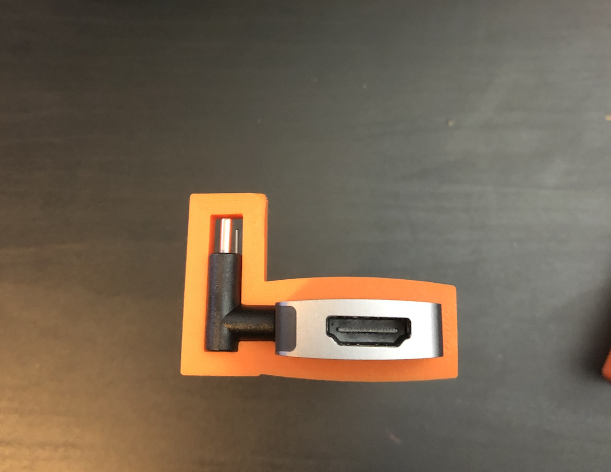

# MacbookDock
Desktop Dock for Macbook Pro 2017

#### Unassembled Components (Anker Hub, USB-C Elbow Joints, Two-Piece Dock)

#### Installing the Components

#### Hub Installed

#### Assembled Dock - note cutouts for airflow

## Testing
#### Testing to make sure hub and USB-C elbow joints will slide into place properly

